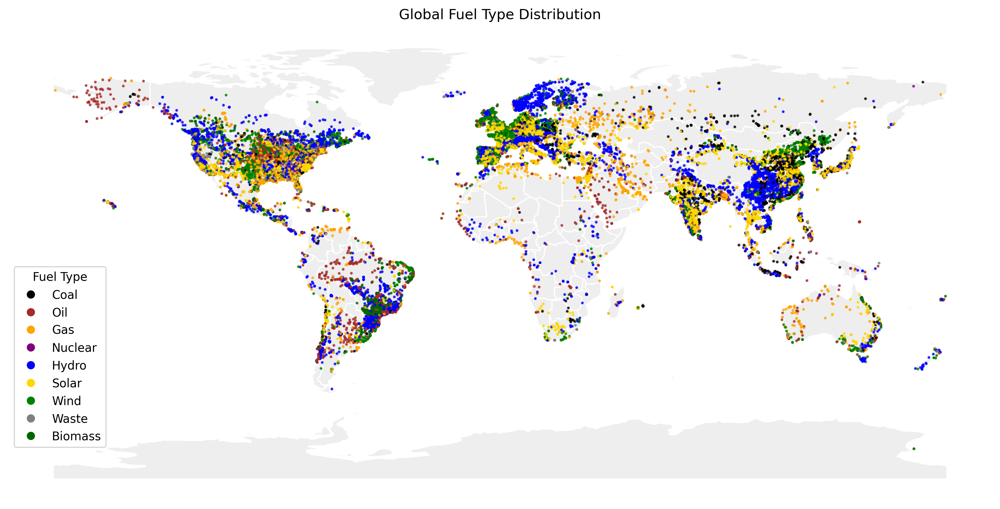

# Global Power Plant Analysis

## Project Overview
This project provides a comprehensive data quality assessment and geospatial analysis of the **Global Power Plant Database (v1.3.0)**. The goal was to build a robust cleaning pipeline and validate high-density asset clusters using external geographical APIs.

## Key Technical Features
* **Automated QA Pipeline:** Identified and handled invalid coordinates, missing values, and duplicate records.
* **Statistical Anomaly Detection:** Implemented **Z-score diagnostics** to identify and filter ~700 extreme capacity outliers (|Z| > 3).
* **Geospatial Validation:** Used **Reverse Geocoding (GeoPy)** with try-except error handling to verify the legitimacy of industrial clusters in Indonesia, Brazil, Spain and India.
* **Advanced Visualization:** Generated a high-contrast global distribution map using a custom-built "Line2D" legend.

## Data Source
The dataset is provided by the **World Resources Institute (WRI)** under the CC BY 4.0 license.
* **Citation:** Global Energy Observatory, Google, KTH Royal Institute of Technology, Enipedia, World Resources Institute. 2019. Global Power Plant Database.

## How to Use
1. Clone the repository.
2. Ensure you have the required libraries installed: pandas, geopandas, matplotlib, scipy, geopy.
3. Open and run the Jupyter Notebook: `Global_Power_Plant_Analysis.ipynb`.

## Author
**Csenge Arany**
* Survey Statistics and Data Analytics MSc Student at ELTE
